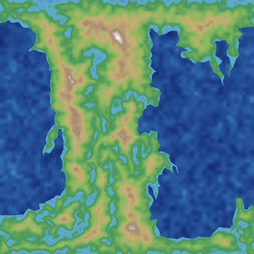
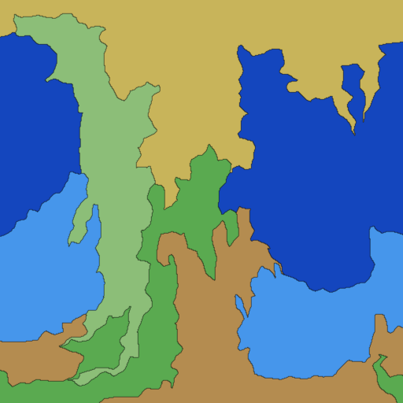
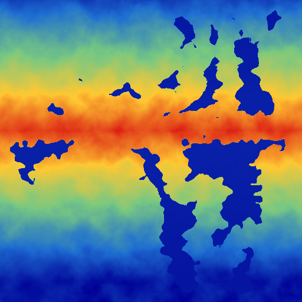
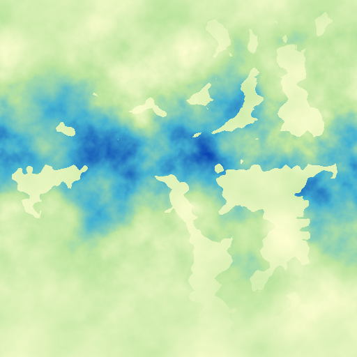
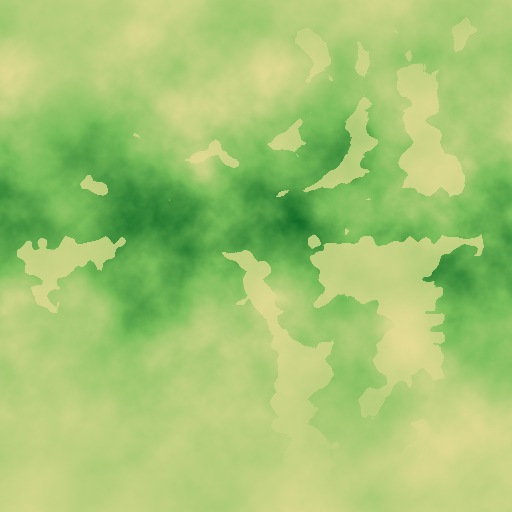
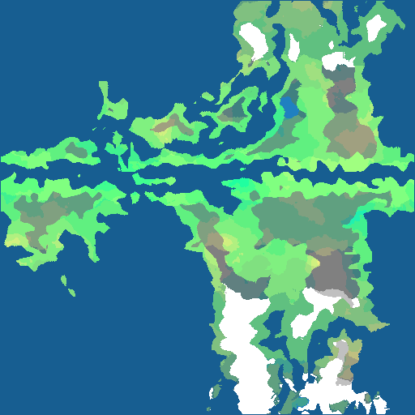

# WorldEngine 球面 Voronoi 世界生成器

> A world generator built on WorldEngine, replacing the platec tectonic
> simulation with a **domain-warped spherical Voronoi** plate system.

本项目基于 [WorldEngine](https://github.com/Mindwerks/worldengine)，用**域扭曲球面 Voronoi** 取代传统的 platec 板块构造仿真，生成 30 个微板块并归并为 6 大板块，再叠加合成高程、运行完整气候仿真，最终输出 19 张彩色阶段图。支持最高 **4096 × 2048** 单图分辨率，并附带一个交互式 Web 生成器。

This project is built on [WorldEngine](https://github.com/Mindwerks/worldengine), replacing the platec tectonic simulation with a **domain-warped spherical Voronoi** plate system. It generates 30 micro-plates, merges them into 6 major plates, synthesizes elevation, runs the full climate simulation pipeline, and outputs 19 colored stage images. It supports up to **4096 × 2048** single-image resolution and ships with an interactive web generator.

---

## 生成管线 / Generation Pipeline

| 阶段 | 说明 | Stage | Description |
|------|------|-------|-------------|
| 1 | 高程 | Elevation | 合成高程地形 |
| 2 | 微板块 | Raw plates | 30 个域扭曲球面 Voronoi 微板块 |
| 2b | 大板块 | Merged plates | 归并为 6 大板块（2 海洋 + 4 大陆） |
| 3 | 居中 | Center land | 陆地居中处理 |
| 4 | 噪声 | Noise elevation | 叠加噪声高程 |
| 5 | 海洋边界 | Ocean borders | 边界海洋处理 |
| 6 | 海洋初始化 | Ocean init | 海陆阈值初始化 |
| 7 | 海洋掩膜 | Ocean mask | 海陆二值掩膜 |
| 8 | 海洋深度 | Sea depth | 海洋深度 |
| 9 | 温度 | Temperature | 温度场 |
| 10 | 降水 | Precipitation | 降水场 |
| 11 | 河流 | Rivers | 河流水系 |
| 12 | 湖泊 | Lakes | 湖泊水系 |
| 13 | 侵蚀 | Eroded elevation | 侵蚀后的高程 |
| 14 | 水量图 | Watermap | 地表水分布 |
| 15 | 灌溉 | Irrigation | 灌溉条件 |
| 16 | 湿度 | Humidity | 湿度场 |
| 17 | 渗透性 | Permeability | 土壤渗透性 |
| 18 | 生物群系 | Biome | Holdridge 生命地带 |
| 19 | 冰盖 | Icecap | 极地冰盖 |

### 阶段图预览 / Stage Previews

| 高程 / Elevation | 微板块 / Raw Plates | 大板块 / Merged Plates |
|------------------|---------------------|------------------------|
|  |  |  |

| 温度 / Temperature | 降水 / Precipitation | 湿度 / Humidity |
|--------------------|----------------------|-----------------|
|  |  |  |

| 生物群系 / Biome | 海洋深度 / Sea Depth | 冰盖 / Icecap |
|------------------|----------------------|---------------|
|  |  |  |

> 全部 19 张阶段图可在 `stage_images/index_voronoi.html` 图集中查看。
> All 19 stage images are browsable in the `stage_images/index_voronoi.html` gallery.

---

## 快速开始 / Quick Start

### 环境要求 / Requirements

- Python 3.9+（本项目在 3.9–3.14 下测试通过）
- NumPy、Pillow、scipy、Flask
- WorldEngine（仓库内的 `worldengine/` 目录）

```bash
# 安装依赖
pip install numpy pillow scipy flask
```

### 生成阶段图 / Generate stage images

```bash
# 默认 4096 × 2048 分辨率，seed = 1
python3 tools/generate_stages_voronoi.py
```

输出写入 `stage_images/`，包含 `01_sv_elevation.png` 至 `19_sv_icecap.png` 共 19 张彩色阶段图。

### 交互式 Web 生成器 / Interactive web generator

```bash
python3 tools/web_server.py --port 8080
```

打开 <http://localhost:8080> 即可通过参数滑块（seed、尺寸、微板块数、大板块数、域扭曲幅度）实时生成世界地图。前端提供 256×256 至 **4096×2048** 的尺寸选项，并返回微板块、合并板块、高程地形、温度、降水、湿度、生物群系、冰盖等多张图。

---

## 核心算法 / Core Algorithm

### 球面 Voronoi（`tools/spherical_voronoi.py`）

1. **种子采样**：在球面上做最远点采样（farthest-point sampling），首个种子远离球面中心（经度 77° 外），保证板块分布不汇聚于两极。
2. **域扭曲**：用低分辨率 FBM 噪声（1 octave，48px 基频）对像素方向做微小扰动（默认 `DOMAIN_AMP=0.06`），产生平滑自然的弯曲板块边界——**噪声只作用于 Voronoi 的输入坐标，不参与边界输出**。
3. **压力松弛**：12 轮迭代按面积均衡调整各板块压力，保证无空板块、面积大致均匀；距离在每次迭代中按 64 行分块重算，**内存占用恒定**，可支持超大分辨率。
4. **碎片清理**：每块只保留最大 8-连通分量，消除投影碎片；小碎块重指派给相邻最常见板块。
5. **大陆生长**：取距海洋反中心最近的 2 个板块为海洋种子，按图距离最远的 4 个板块为大陆核，沿邻接图做面积均衡多源 BFS，生成 2 海洋 + 4 大陆共 6 大板块。
6. **飞地清理**：面积占比小于 0.05% 的孤立小块归并到相邻板块。

性能优化：`scipy.ndimage` 向量化组件标记与距离变换，替代纯 Python BFS；板块面积与质心用 `numpy.bincount` 一次扫描完成。

### 高程与气候（`tools/generate_stages_voronoi.py`）

- 高程 = 板块内部距离场（大陆内部高、边缘低）+ 多层分形噪声，海平面以下为海洋。
- 复用 WorldEngine 的完整气候仿真链：中心化 → 噪声 → 海洋初始化 → 温度 → 降水 → 侵蚀 → 水系 → 湿度 → 渗透性 → Holdridge 生物群系 → 冰盖。

---

## 项目结构 / Project Layout

```
tools/
  generate_stages_voronoi.py  # 逐阶段生成 19 张彩色 PNG（默认 4096x2048）
  web_server.py               # Flask 交互式生成器（API + 前端）
worldengine/
  spherical_voronoi.py        # 域扭曲球面 Voronoi 核心（种子、分区、合并、生长）
  plates.py                   # 板块生成入口（调用 spherical_voronoi，无 PyPlatec C 扩展）
  ...                         # WorldEngine 其余底层库（气候仿真、绘制、序列化等）
stage_images/                 # 输出目录：01_sv_*.png ~ 19_sv_*.png + 图集 index.html
```

---

## License

WorldEngine is available under the MIT License — see `LICENSE` in the project root.
